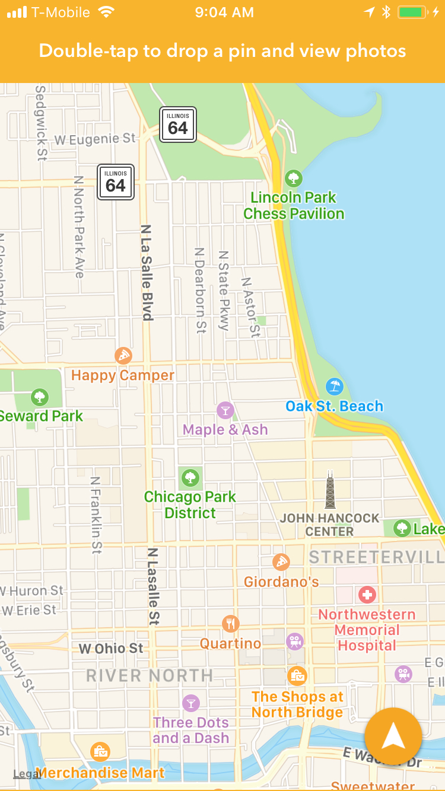
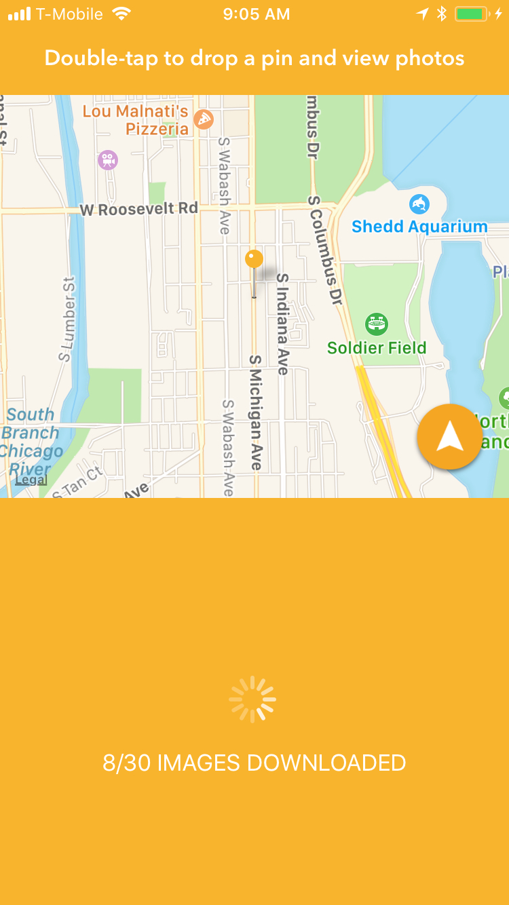
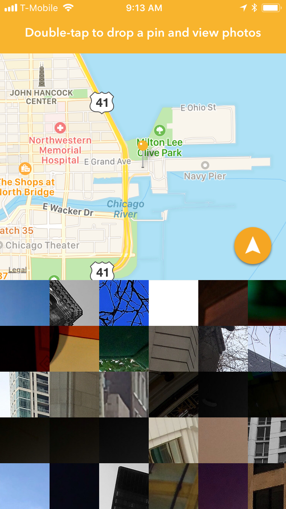

# DevSlopesProj-PixelCity
iOS app demo were user can browse Flickr photos based off map location

Made for the iOS 11 development course from DevSlopes. Features a map view, where users can choose a location and view the 30 most recent Flickr photos from that location.

App does use the Flickr API. If you are trying this project out, kindly register with Flickr for API access and use your own API key, not mine. You can change the API key in `Pixel City/Utilities/FlickrUtil.swift` and go to Line 13.

This app also has Peek and Pop navigation features, but they are untested because I don't have a *3D Touch* or *Force Touch* compatiable device.

The project requires certain Cocoapod libraries, see the Podfile for more information.

